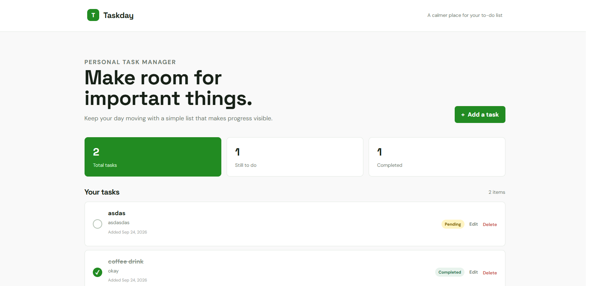
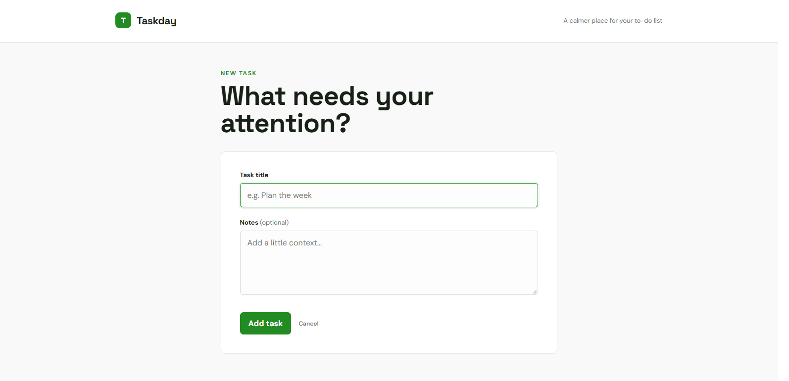
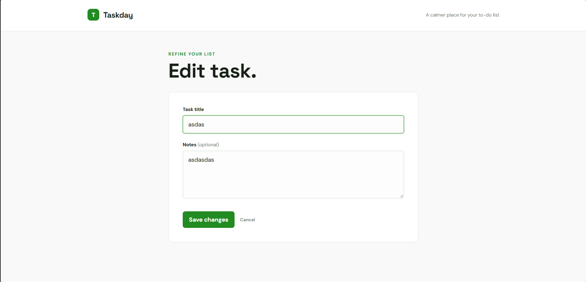
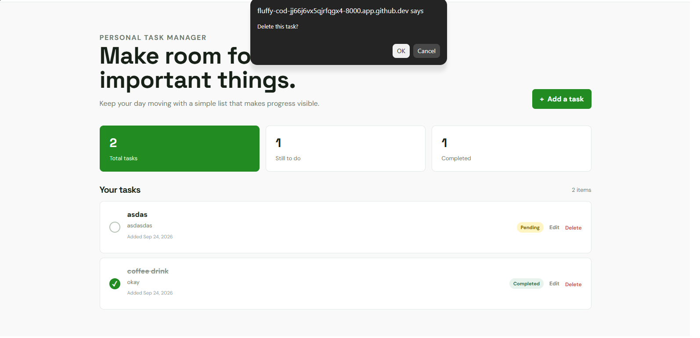

# Personal Task Manager

## Submission Information

Project Code: WST21-PM-2026-SF<br>
Student Name: TINGA, NHEIL B.<br>
Course & Year: BSIT-2<br>
Database Used: SQLite


## Features

- Add Task
- View Tasks
- Edit Task
- Delete Task
- Update Status

## Technology

- Laravel
- PHP
- SQLite
- Blade templates

## Application Walkthrough

The screenshots below show the complete task-management workflow from creating a task to marking it as completed.

### Step 1: Open the task list

The home page displays the Personal Task Manager dashboard. When there are no tasks, the empty-state message invites you to create your first task. Select **Create first task** or **Add a task** to begin.



### Step 2: Create a task

Enter a task title in the **Task title** field. You can also add optional notes to provide more context, then select **Add task** to save it.



### Step 3: Review and manage tasks

After saving, the task appears in **Your tasks** with its title, notes, date added, and `pending` status. From this list, select **Edit** to update the task or **Delete** to remove it.



### Step 4: Update the task status

Select the status toggle beside a pending task to mark it as completed. The dashboard counters update automatically, and the task is shown with a completed state. Select the toggle again if the task needs to return to pending.



## Local Setup

```bash
composer install
cp .env.example .env
php artisan key:generate
touch database/database.sqlite
php artisan migrate
php artisan serve
```

Open the local URL shown by `php artisan serve` in your browser.

## License

This project is licensed under the MIT License.
